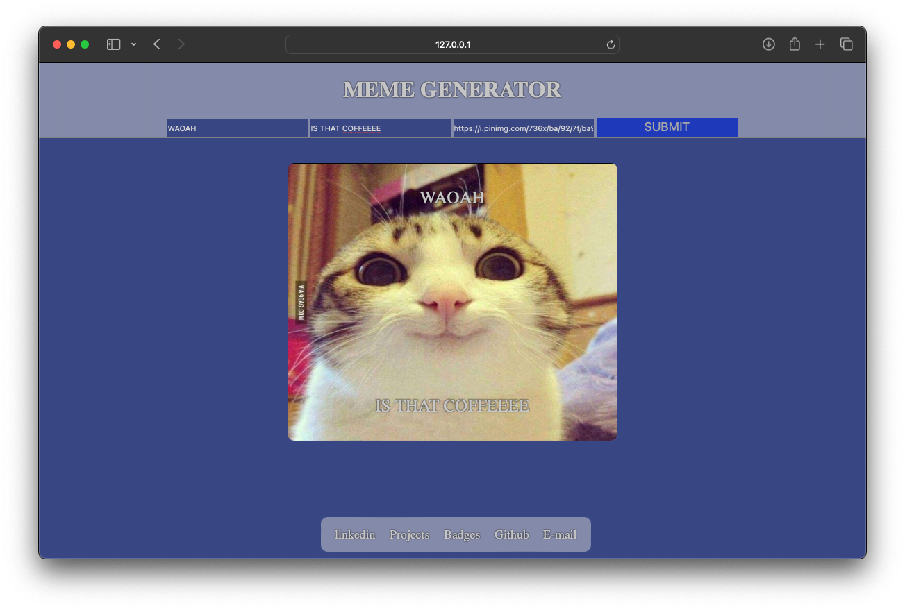

Crafting a meme with a JavaScript program involves utilizing code to dynamically generate and manipulate images or text elements, resulting in humorous or impactful visual content. Through JavaScript, one can manipulate the layout, style, and content of the meme, adding custom captions, overlays, or effects as desired. This process empowers creators to personalize their memes programmatically, fostering creativity and innovation in meme-making.

HOW TO RUN 
------------------------------------
* To get started, navigate to the Meme-generator repository on GitHub and download the files. Then, open the folder in Visual Studio Code and launch the live server extension. This action  will automatically open the project in your default web browser.

Click here to view live:
[Visit website](https://08milam.github.io/Meme-generator/)

1. Visit Google Images.
2. Right-click on the image.
3. Select "Copy Image Address."
4. Paste the copied URL into the image input field.

TECHNOLOGY STACK USED
------------------------------------
* HTML
* CSS
* JavaScript

